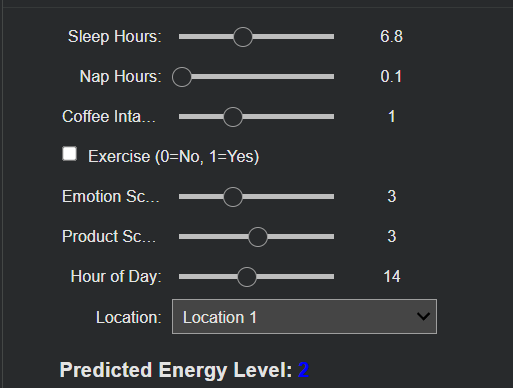

# Nguyen Personal Energy Analysis Project 
All data files and code are included in the software package. 

# To run
To run please upload the source code to Google colab and put the respective data files in the root directory. 

**For PreProcessing:**
```
/NguyenEnergyDataRaw.csv
```

**For Model code**
```
/NguyenEnergyDataCleaned.csv
```

Basic model evaluation and some interactive scripts are also included in the software package to try :) 


# User Interactive Scripts


For the user interactive scripts Location is encoded with a numerical value. 

**Translation Table**

| Location      | Encoding |
|---------------|-------|
| Work          | 1     |
| School        | 2     |
| Class         | 3     |
| Home/Other    | 4     |


